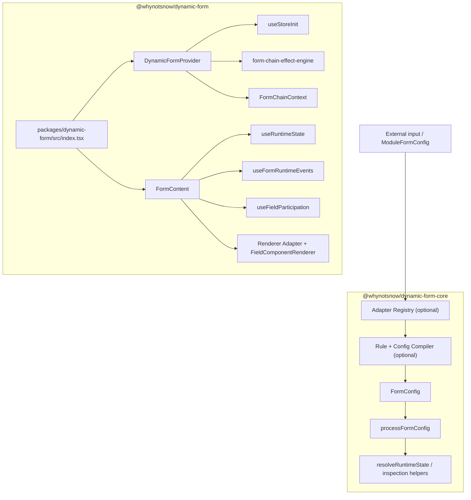

# 架构说明

DynamicForm 4.2 由 `@whynotsnow/dynamic-form-core` 纯核心包和 `@whynotsnow/dynamic-form` React/AntD 兼容包组成。core 承载 Field Address、统一节点树、Adapter / Module / Rule / Compiler 预处理能力、配置处理、配置诊断和纯 Runtime resolver；React/AntD 包承载 `DynamicForm`、Provider、hooks、Form Adapter / Renderer Adapter、component registry、默认 AntD renderer 和 effect handler runtime。核心目标是让字段逻辑标识和值路径分离，并让外部输入归一化、领域模块展开、配置解析、状态维护、运行时策略、表单值读写和 UI 渲染各自保持清晰边界。

## 仓库结构

当前仓库是 monorepo：

- `packages/dynamic-form-core/` 是纯 core npm 发布包边界，包含配置、compiler、adapters、rules、纯 Runtime 和共享纯类型。
- `packages/dynamic-form/` 是 React/AntD npm 发布包边界，依赖 core 并继续 re-export core 公共 API。
- `packages/dynamic-form/docs/` 是 React/AntD 兼容入口文档的维护源，随 npm 包一起维护和发布。
- 根 `docs/` 只维护 monorepo 级文档，例如 workspace 结构、发布流程、站点规划和仓库维护规则。
- `apps/docs-site/` 是 Docusaurus 文档站，使用站点自己的 zh-CN docs 和 `i18n/en` 文档内容。
- `demos/` 保留 Vite demo 和 `demoRegistry`，站点只复用 demo 组件与注册信息，不复制 demo 业务逻辑。

## 模块关系

4.2 主流程仍然是 `FormConfig -> adapter/compiler -> processFormConfig -> Runtime -> renderer`。`DynamicForm` 继续接收现有 `FormConfig`；Adapter、Compiler、Rule Engine 和 Schema Adapters 是可选预处理层，最终仍输出标准 `FormConfig`。`fields`、`groups` 和 `nodes` 会在 Config Layer 归一成同一棵节点树。未传 `formAdapter` / `renderer` 时，默认使用 `createAntdFormAdapter(form)` 和 `antdRenderer`。区别在于 UI-library agnostic 的配置、编译、规则和纯 Runtime 能力已归属 core 包，React/AntD 包负责消费这些能力并提供默认渲染运行时。

## 关键文件

- `packages/dynamic-form-core/src/adapters/`：把 module-like、JsonSchema、OpenAPI 和 metadata 输入归一化为 `ModuleFormConfig`。
- `packages/dynamic-form-core/src/modules/`：定义 `FieldModule` 协议和模块注册器。
- `packages/dynamic-form-core/src/rules/`：校验、求值声明式规则，并把规则编译为标准 effects。
- `packages/dynamic-form-core/src/compiler/compileFormConfig.ts`：把 `ModuleFormConfig` 编译为标准 `FormConfig` 和组件注册表。
- `packages/dynamic-form-core/src/config/processor/configParser.ts`：归一化节点树，生成 `effectMap`、`nodeRegistry`、`containerRegistry`、`fieldRegistry`、`initialValues`、初始化后的字段和 container 状态。
- `packages/dynamic-form-core/src/runtime/`：解析字段、container 和 group 的纯运行时能力，并提供 inspection helpers。
- `packages/dynamic-form/src/CompiledDynamicForm.tsx`：把 compiler 产物及其组件注册表接入 `DynamicForm`。
- `packages/dynamic-form/src/index.tsx`：拆分 `DynamicFormProps`，把引擎层 props 交给 Provider，把 UI 层 props 交给 FormContent。
- `packages/dynamic-form/src/consumer/provider/DynamicFormProvider.tsx`：初始化 store、effect engine 和 React context。
- `packages/dynamic-form/src/consumer/formAdapter.ts`：提供默认 AntD form adapter，并把旧 `form` 实例转换为中立 `DynamicFormFormAdapter`。
- `packages/dynamic-form/src/state/useStoreInit.ts`：处理配置、创建 reducer state、合并初始值并通过 form adapter 同步到表单运行时。
- `packages/dynamic-form/src/state/reducer.ts`：用 Immer 处理字段 meta、分组 meta 和动态 UI 配置更新。
- `packages/dynamic-form/src/consumer/render/FormContent.tsx`：遍历 Runtime 节点，调用 renderer adapter，并连接提交、变更事件。
- `packages/dynamic-form/src/consumer/render/antdRenderer.tsx`：默认 AntD renderer，负责 `Form`、`Form.Item`、`Form.List`、`Row`、`Col`、`Card` 和 `Button` 外壳。
- `packages/dynamic-form/src/consumer/effects/`：通过 handler 系统应用 effect 返回值。
- `packages/dynamic-form/src/consumer/render/componentRegistry.tsx`：提供内置组件和自定义组件注册能力。

## 数据流

1. 可选 Adapter 把外部输入归一化为 `ModuleFormConfig`。
2. 可选 Compiler 展开字段模块、编译字段/group rules，并生成标准 `FormConfig` 与组件注册表。
3. 用户通过 `DynamicForm` 传入手写 `FormConfig`，或通过 `CompiledDynamicForm` 传入 compiler 产物。
4. `DynamicForm` 把引擎层参数传给 `DynamicFormProvider`，把 UI 参数传给 `FormContent`。
5. `useStoreInit` 调用 `processFormConfig(formConfig)`。
6. 配置处理把 `nodes`、`fields` 和 `groups` 归一化为节点树，生成依赖图、node/container/field registry、初始值和初始化后的字段/container 状态。
7. reducer 接收 `INIT`，保存节点结构、meta、配置处理信息和动态 UI 配置。
8. `DynamicFormProvider` 用 `effectMap` 初始化 `form-chain-effect-engine`。
9. `FormContent` 基于 reducer state 计算一次 `runtimeState`。
10. 渲染、提交校验、字段变更校验和隐藏字段参与策略共同使用这份 `runtimeState`。
11. 用户输入触发 runtime 过滤后的校验，再把变更值交给 effect engine。
12. effect 返回值进入 `applyEffectResult`，handler 通过 form adapter 更新表单值，或更新字段 meta、分组 meta、动态 UI 配置。

## 状态归属

Form runtime 负责；默认实现是 Ant Design Form：

- 字段值
- 校验 errors 和 warnings
- touched 和 validating 状态
- 提交时的数据读取

DynamicForm reducer 负责：

- 平铺字段状态
- container/group 字段状态
- 节点状态与根节点顺序
- 字段行为 meta 和渲染 meta
- container/group 行为 meta
- 配置处理信息
- 动态 UI 配置
- initialized 标记

reducer 不维护重复的 values store。更新值的 effect handler 应调用上下文提供的 `setFieldValue` 或 `formAdapter`。

## 分层职责

- Core Adapter Layer：只负责把外部输入转换为 `ModuleFormConfig`，不决定 renderer 行为。
- Core Module / Compiler Layer：展开领域字段模块、装配 flat/grouped/mixed/nodes 结构，并输出标准 `FormConfig`。
- Core Rule Layer：把同步声明式规则编译为标准 effects，不替代 effect engine 或 Ant Design validation。
- Core Config Layer：把 flat/grouped/mixed/nodes `FormConfig` 归一化为节点树和标准化运行时输入。
- State Layer：在 React/AntD 包中保存初始化后的字段/container 结构和 meta，并兼容旧的 flat meta key。
- Runtime Layer：core 提供纯 resolver，React/AntD 包通过 `useRuntimeState` 为 UI 消费同一份 Runtime snapshot。
- Consumer Layer：连接 Provider、form adapter、renderer adapter、hooks、effect 结果处理和组件注册。
- Shared Layer：core 存放纯公共类型和工具，React/AntD 包补充 React context、初始化检查和 UI 相关类型。

## 维护约束

- 字段查找应使用 `configProcessInfo.fieldRegistry`，因为字段可能是平铺字段，也可能在任意 container 内。
- `FormContent` 应对每个 state snapshot 只计算一次 Runtime。
- 校验必须通过 `runtimeState.fields[fieldId].validatable` 过滤。
- 隐藏字段默认不参与提交，除非字段配置显式保留值。
- Container 可见性必须沿父链传递给所有后代字段和 container。
- render hooks 可以绕过默认渲染，因此修改扩展行为时要谨慎。
- Adapter、Compiler 和 Rule Engine 应保持在 React runtime 之外，不直接维护 Form 实例或 reducer state。
