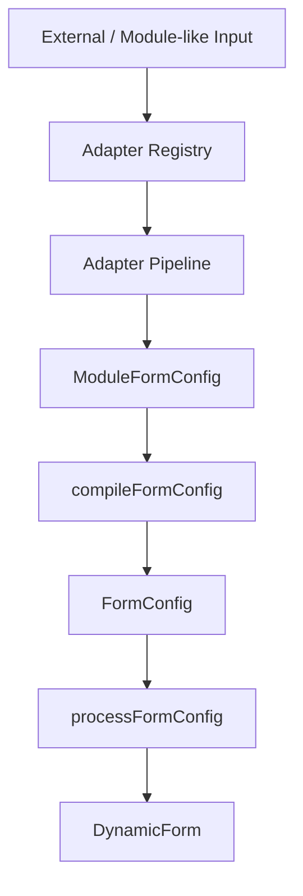

# Adapter Foundation

Adapter Foundation 位于 Compiler Foundation 之前，用于把外部或类模块输入归一化为结构化 `ModuleFormConfig`。



Adapter 只负责输入转换。规则合并、依赖推导、组件注册和 `FormConfig` 生成仍由现有 compiler 负责。

## Adapter

```ts
import type { ModuleConfigAdapter } from '@whynotsnow/dynamic-form';

const adapter: ModuleConfigAdapter<{ fields: Array<{ name: string; type: string }> }> = {
  type: 'custom-metadata',
  supports: (input): input is { fields: Array<{ name: string; type: string }> } =>
    !!input && typeof input === 'object' && Array.isArray((input as any).fields),
  adapt: (input) => ({
    fields: input.fields.map((field) => ({
      type: field.type,
      id: field.name
    }))
  })
};
```

## Registry

```ts
import { AdapterRegistryManager } from '@whynotsnow/dynamic-form';

const registry = new AdapterRegistryManager();

registry.register(adapter);
registry.has('custom-metadata');
registry.get('custom-metadata');
registry.list();
registry.unregister('custom-metadata');
```

重复 adapter type 默认会报错。只有显式传入 `{ override: true }` 时才允许覆盖。

## Pipeline

```ts
import { adaptModuleConfigs, compileAdaptedFormConfig } from '@whynotsnow/dynamic-form';

const moduleFormConfig = adaptModuleConfigs(input, {
  registry,
  adapterType: 'custom-metadata'
});

const compiled = compileAdaptedFormConfig(input, {
  adapterRegistry: registry,
  moduleRegistry
});
```

未指定 `adapterType` 时，pipeline 会按注册顺序选择第一个 `supports()` 成功的 adapter。
默认顺序是 passthrough、JsonSchema、OpenAPI、Metadata。因此单个 object schema 会优先由 JsonSchema adapter 处理；需要强制 OpenAPI 的单 schema 兼容路径时，应显式传入 `adapterType: 'openapi'`。

## Boundaries

- Adapter Foundation 本身不负责 JsonSchema、OpenAPI 或 Metadata 的具体映射。
- Adapter Foundation 不修改 `compileFormConfig()`、`processFormConfig()`、runtime 或 renderer 的职责。
- Adapter Foundation 不引入异步规则、async validation compile、validation rule engine 或 monorepo 拆包。
- Adapter 输出统一为 `{ fields, groups? }`，字段通过 `groupId` 加入 group，可表达 flat、grouped 和 mixed 配置。

当前版本同时包含 `JsonSchemaAdapter`、`OpenApiAdapter` 和 `MetadataAdapter`，详见 [Schema Adapters](./schema-adapters.md)。以上边界仅描述 Adapter Foundation 本身的职责范围。
