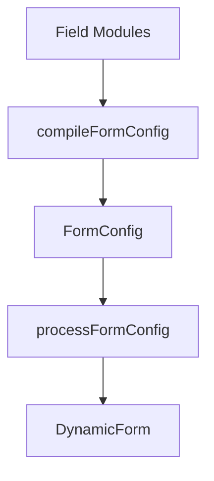

# Compiler Foundation

DynamicForm 在现有 `FormConfig` 管线之前提供字段模块和配置编译层。4.0 的 compiler 同时支持 flat fields、legacy groups 和递归 `nodes`。



这是增量能力。现有 `FormConfig` 用法不需要迁移。

### Field Modules

字段模块用于封装可复用的业务字段能力：

```ts
import type { FieldModule } from '@whynotsnow/dynamic-form';

interface UserSelectorOptions {
  label?: string;
  options?: Array<{ label: string; value: string }>;
}

export const UserSelectorModule: FieldModule<UserSelectorOptions> = {
  type: 'UserSelector',
  defaultProps: {
    allowClear: true,
    showSearch: true
  },
  dependencies: ['departmentId'],
  createConfig: (options) => ({
    id: 'userId',
    label: options?.label ?? 'User',
    component: 'Select',
    componentProps: {
      options: options?.options ?? []
    }
  })
};
```

模块描述业务字段；渲染组件仍由现有组件注册体系解析。

`FieldModule<TOptions>` 和 `ModuleConfig<TOptions>` 支持模块级 options 类型约束。默认泛型仍是 `Record<string, unknown>`，因此现有调用无需迁移。Registry 继续按运行时 `type` 管理模块；当前版本不尝试在一个异构配置数组中建立 `type` 与 options 的全局类型映射。

### Registry

使用 `ModuleRegistryManager` 创建隔离注册器，或使用 `defaultModuleRegistry` 做共享注册。

```ts
import { ModuleRegistryManager } from '@whynotsnow/dynamic-form';

const registry = new ModuleRegistryManager();

registry.register(UserSelectorModule);
registry.has('UserSelector');
registry.get('UserSelector');
registry.list();
registry.unregister('UserSelector');
```

重复模块类型默认会被拒绝。只有明确传入 `{ override: true }` 时才允许覆盖。

### Compiler

把模块配置编译成标准 `FormConfig`：

```tsx
import { Form } from 'antd';
import { DynamicForm, compileFormConfig } from '@whynotsnow/dynamic-form';

const compiled = compileFormConfig(
  {
    fields: [
    {
      type: 'UserSelector',
      id: 'ownerId',
      options: { label: 'Owner' },
      overrides: {
        required: true
      }
    }
    ]
  },
  { registry }
);

export function Example() {
  const [form] = Form.useForm();

  return (
    <DynamicForm
      form={form}
      formConfig={compiled.formConfig}
      componentRegistry={{ customComponents: compiled.componentRegistry }}
    />
  );
}
```

推荐使用高层 `CompiledDynamicForm`，它会自动接入 compiler 返回的组件注册表：

```tsx
import { CompiledDynamicForm } from '@whynotsnow/dynamic-form';

<CompiledDynamicForm form={form} compiled={compiled} />;
```

需要添加或覆盖 compiler 组件时，仍可传入 `componentRegistry`；显式传入的同名 custom component 优先。底层 `DynamicForm` 手动接入方式继续保留，适合需要分别控制 config 和 registry 的场景。

编译器返回：

```ts
{
  formConfig: FormConfig;
  componentRegistry: ComponentRegistry;
}
```

`formConfig` 可以继续传给 `processFormConfig()` 或 `DynamicForm`。

### Mixed Fields 与 Groups

Compiler 输入统一为 `ModuleFormConfig`。字段可以通过 flat `fields` 声明，并用 `groupId` 加入 legacy group；也可以通过 `nodes` 声明递归节点树。Group/container rules 只支持 `show` 和 `hide`，手工 `effect` 先执行，rules 后执行并覆盖同名结果键。

```ts
compileFormConfig({
  fields: [
    { type: 'AccountType', id: 'accountType' },
    { type: 'CompanyName', id: 'companyName', groupId: 'companyInfo' }
  ],
  groups: [
    {
      id: 'companyInfo',
      title: '企业信息',
      initialVisible: false,
      rules: [{ when: { field: 'accountType', equals: 'company' }, then: { action: 'show' } }]
    }
  ]
});
```

Compiler 会校验全局 ID 唯一、group 引用有效且 group 非空。

### Nodes 与 Container

`ModuleFormConfig.nodes` 用于声明递归模块树。字段节点使用 `nodeType: 'field'`，container 节点使用 `nodeType: 'container'`：

```ts
const compiled = compileFormConfig({
  nodes: [
    {
      nodeType: 'container',
      id: 'shipping',
      title: '收货信息',
      name: 'shipping',
      rules: [{ when: { field: 'hasShipping', equals: true }, then: { action: 'show' } }],
      children: [
        {
          nodeType: 'field',
          type: 'TextInput',
          id: 'shippingCity',
          options: { label: '城市' }
        }
      ]
    }
  ]
});
```

Compiler 会把字段模块展开为 `FieldNode`，把 container 展开为 `ContainerNode`。模块组件仍会进入 `componentRegistry`，因此 `CompiledDynamicForm` 是渲染 compiler 产物的推荐入口。

Container 可以声明 `name`，运行时配置处理会把它作为子字段 Ant Design `NamePath` 前缀。`repeatable: true` 的 container 必须声明 `name`，默认 renderer 通过 Ant Design `Form.List` 渲染已有重复项。

### Hooks

编译器支持编译期扩展点：

```ts
compileFormConfig(moduleFormConfig, {
  registry,
  hooks: {
    beforeCompile(context) {},
    beforeModuleExpand(context) {},
    afterModuleExpand(context) {},
    afterCompile(context) {}
  }
});
```

hooks 只操作编译上下文，不应该修改 Ant Design Form 实例或 React 运行时状态。

### Boundaries

- `compileFormConfig()` 负责生成 `FormConfig`。
- `processFormConfig()` 继续负责准备运行时数据。
- `DynamicForm` props 不变。
- `compileFormConfig()` 支持 flat、grouped、mixed 和 recursive nodes 输出。
- Group 不改变字段值路径；container `name` 会作为后代字段的值路径前缀。
- Ant Design Form 仍然是 values 和 validation state 的唯一真实来源。
