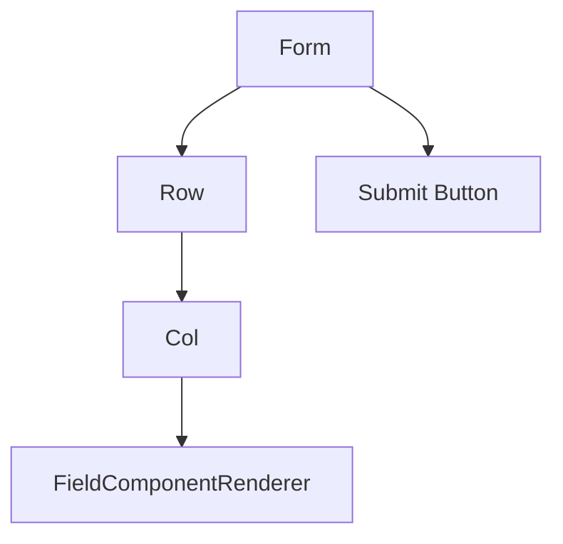
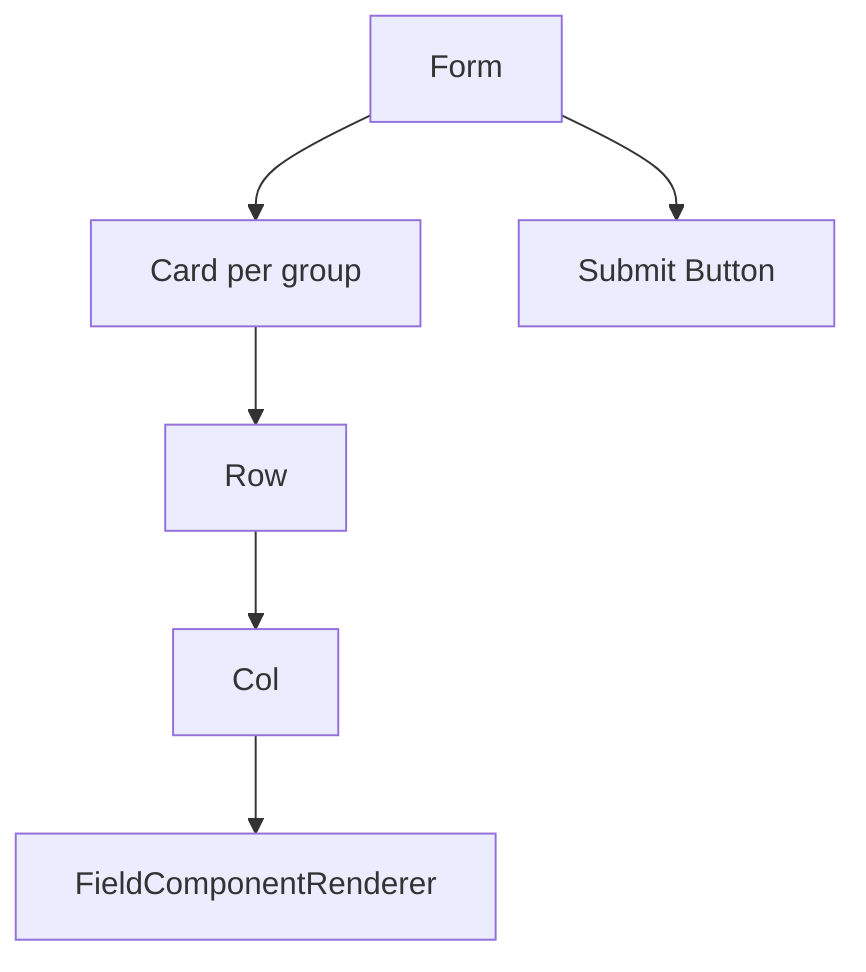

# 渲染与 UI 扩展

`FormContent` 提供默认渲染流水线，并暴露分层扩展点。4.1 起默认 UI 由 `antdRenderer` 提供，业务侧可以继续使用 render hooks 局部扩展，也可以通过 `renderer` 替换默认外壳。

### 默认渲染结构

平铺表单：



分组表单：



默认 `antdRenderer` 使用：

- `Form`
- `Row`
- `Col`
- `Card`
- `Button`

`FieldComponentRenderer` 负责解析组件、应用 `Form.Item` props、应用 runtime disabled/readonly 状态，并在字段不可校验时移除 `Form.Item` rules。字段 `required: true` 会在默认 Ant Design renderer 中自动合并为 required rule；显式 `rules` 中的 required rule 优先。

### 4.1 Form / Renderer Adapter

4.1 新增两个可选扩展入口：

- `formAdapter`：封装表单值读写和校验，包括 `getFieldValue`、`getFieldsValue`、`setFieldValue`、`setFieldsValue`、`validateFields`。
- `renderer`：封装默认 UI 外壳，包括 form、字段项、字段集合布局、字段布局、分组容器、repeatable container 和提交按钮。
- `assertFormAdapter` / `assertRendererAdapter`：在初始化阶段提前校验自定义 adapter 的必需方法。

未传 `formAdapter` 时，`DynamicForm` 会把旧的 AntD `form` 实例转换为 `createAntdFormAdapter(form)`。未传 `renderer` 时，默认使用 `antdRenderer`。因此 4.0 的 AntD 用法继续兼容：

```tsx
<DynamicForm form={form} formConfig={formConfig} />
```

自定义组件库 renderer 可以先复用核心 Runtime 和 render hooks，只替换默认 UI 外壳：

```tsx
<DynamicForm
  formAdapter={customFormAdapter}
  renderer={customRenderer}
  formConfig={formConfig}
/>
```

4.1.1 还提供两个无组件库依赖的 reference 实现：

- `createMemoryFormAdapter(initialValues)`：维护一个内存 values store，提供 no-op `validateFields`，适合测试、自定义 renderer 示例和可视化预览态。
- `headlessRenderer`：使用原生 `<form>`、`<label>`、`<div>`、`<fieldset>` 和 `<button>` 渲染最小 UI 外壳；它不是生产级组件库替代品。

4.1 只提供 AntD 默认实现、headless reference implementation 和扩展接口，不内置 Arco、Semi 或其他组件库 renderer。

4.1.2 明确 adapter 最低契约：

- `formAdapter.validateFields(names)` 必须接受 `FieldNamePath[]`，并只校验传入字段；如果底层表单库不支持局部校验，应在 adapter 内做兼容。
- `formAdapter.getFieldsValue(true)` 必须返回包含嵌套路径的完整 values；提交过滤由 DynamicForm 根据 Runtime 再处理。
- `renderer.renderForm()` 必须把 DynamicForm 提供的 `onFinish`、`onValuesChange` 和 `children` 接入底层表单外壳。
- `renderer.renderFieldItem()` 必须负责字段项外壳，并接收 renderer 生成的 `defaultRender`；render hooks 会在它之后继续包装或替换。
- 自定义 adapter 应先通过 `assertFormAdapter` / `assertRendererAdapter` 校验，再进入预览或生产渲染路径。

### Nodes 与 container 渲染契约

4.0 的 `nodes` 入口会把 root nodes 按顺序渲染为“字段连续段”和“container 块”：

- 连续字段段统一交给 `renderFields`，默认结构仍是 `Row -> Col -> FieldComponentRenderer`。
- container 是块级边界，会切断前后的字段段；container 默认渲染为 `Card`，内部 children 继续按同一规则递归分段。
- 普通 container 使用 `renderGroupItem` 时，`defaultRender` 包含完整 children 渲染，包括嵌套 container。
- repeatable container 使用 `Form.List`，每个 list item 内部也按连续字段段渲染，并把字段 name 改写为 list item 相对路径。

因此 `renderFields` 不只作用于旧的 flat fields 或 group 内字段，也会作用于顶层连续字段、混合 root nodes 中被 container 切开的字段段、嵌套 container 内字段段，以及 repeatable item 内字段段。

### 组件注册

通过 `componentRegistry` 注册业务字段组件。

```tsx
const componentRegistry = {
  customComponents: {
    ProjectSelect: ProjectSelectField
  },
  allowOverride: false
};

<DynamicForm form={form} formConfig={formConfig} componentRegistry={componentRegistry} />;
```

自定义组件接收：

```ts
interface FieldComponentProps {
  field: FieldState;
  value?: FieldValue;
  onChange?: (value: FieldValue) => void;
  form: unknown;
  formAdapter?: DynamicFormFormAdapter;
}
```

默认情况下，自定义组件不会覆盖内置组件。只有明确需要替换内置组件时，才设置 `allowOverride: true`。

### Render Hooks

render hooks 按作用范围从小到大排列：

| Hook              | 作用                             |
| ----------------- | -------------------------------- |
| `renderFieldItem` | 自定义单个字段项。               |
| `renderFields`    | 自定义字段列表。                 |
| `renderGroupItem` | 自定义单个分组。                 |
| `renderGroups`    | 自定义所有分组。                 |
| `renderFormInner` | 自定义整个表单 body 和提交区域。 |

每个 hook 都会收到下层 render 函数和 `defaultRender`，可以只包装需要扩展的部分。

`renderer` 负责生成默认 UI，render hooks 仍然是更靠近业务侧的覆盖层。也就是说，`renderer` 先生成 `defaultRender`，再由 `renderFieldItem`、`renderFields`、`renderGroupItem`、`renderGroups` 或 `renderFormInner` 包装或替换它。

这个优先级在 4.1.2 保持不变：自定义 renderer 只能决定默认 UI，不能屏蔽业务传入的 render hooks。业务侧如果通过 hook 返回全新的 React 节点，该返回值会覆盖对应层级的 renderer defaultRender。

### 字段项扩展

```tsx
<DynamicForm
  form={form}
  formConfig={formConfig}
  renderFieldItem={({ field, defaultRender }) => {
    if (field.id !== 'username') return defaultRender;

    return (
      <div>
        <div style={{ marginBottom: 8 }}>Username is used for login.</div>
        {defaultRender}
      </div>
    );
  }}
/>
```

### 分组扩展

```tsx
<DynamicForm
  form={form}
  formConfig={formConfig}
  renderGroups={({ groupFields, renderGroupItem }) => {
    const items = Object.values(groupFields).map((group) => ({
      key: group.id,
      label: group.title ?? group.id,
      children: renderGroupItem(group)
    }));

    return <Tabs items={items} />;
  }}
/>
```

### 整体表单扩展

```tsx
<DynamicForm
  form={form}
  formConfig={formConfig}
  renderFormInner={({ fields, renderFields, defaultRender }) => (
    <>
      {renderFields([fields.name, fields.email].filter(Boolean))}
      {defaultRender.submitArea}
    </>
  )}
/>
```

### 扩展方式选择

- 只改默认 Ant Design props：使用 `uiConfig`。
- 字段控件本身有业务逻辑：使用 `componentRegistry`。
- 结构需要变化，例如 Tabs、特殊分组、自定义提交区：使用 render hooks。
- 需要接入另一套 Form 或 UI 外壳：实现 `formAdapter` 和 `renderer`。

默认渲染尊重 Runtime：不可渲染字段返回 `null`，分组隐藏时子字段不渲染，disabled/readonly 会传给组件，不可校验字段不会挂载 rules。

自定义 render hooks 如果不使用提供的 render helper，可能绕过 Runtime 默认行为，应谨慎处理。
