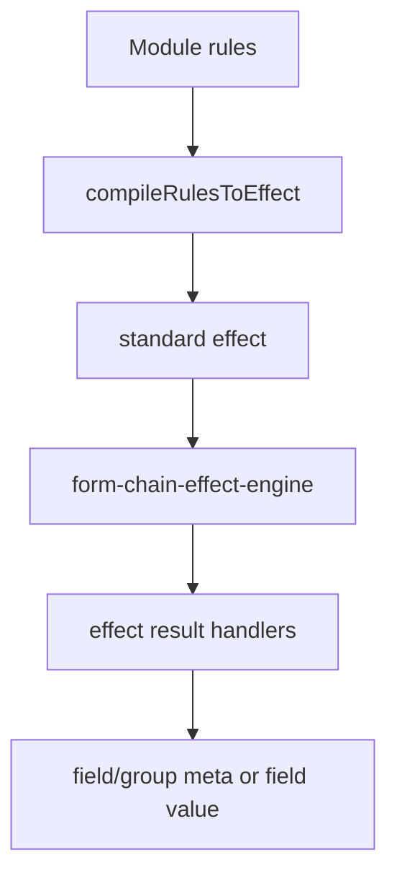

# Rule Engine

DynamicForm 提供声明式同步 Rule Engine。规则属于被影响的字段、group 或 container，并在 compiler 阶段转换为标准 `effect`，因此不会改变 `processFormConfig()`、Runtime Layer 或 renderer 的职责。

## 执行位置



字段模块和 `ModuleConfig` 都可以声明 `rules`。模块规则先合并，实例规则后合并；手写 effect 先执行，规则结果后执行并覆盖同名结果 key。

## 条件

支持以下同步条件：

- 字段条件：`equals`、`notEquals`、`empty`、`notEmpty`
- 组合条件：`all`、`any`、`not`

```ts
const rule = {
  when: {
    all: [
      { field: 'customerType', equals: 'company' },
      { field: 'country', notEquals: 'blocked' }
    ]
  },
  then: { action: 'show' }
};
```

Compiler 默认从 `when` 条件推导 `dependents`。如果规则显式提供 `dependencies`，则使用显式列表。

## 字段动作

字段规则支持：

- `show` / `hide`
- `enable` / `disable`
- `readonly` / `editable`
- `setValue` / `clearValue`

```ts
compileFormConfig({
  fields: [
    {
      type: 'CompanyName',
      id: 'companyName',
      rules: [
        {
          when: { field: 'customerType', equals: 'company' },
          then: [{ action: 'show' }, { action: 'enable' }]
        },
        {
          when: { field: 'customerType', notEquals: 'company' },
          then: [{ action: 'hide' }, { action: 'clearValue' }]
        }
      ]
    }
  ]
});
```

## Group Rules

Group rules 只支持 `show` 和 `hide`，并更新所属 group 的可见性。

```ts
compileFormConfig({
  fields: [{ type: 'CompanyName', id: 'companyName', groupId: 'company' }],
  groups: [
    {
      id: 'company',
      rules: [
        {
          when: { field: 'customerType', equals: 'company' },
          then: { action: 'show' }
        }
      ]
    }
  ]
});
```

## 所有权约束

规则不支持 `target`。字段规则必须声明在被影响字段上，group rule 必须声明在被影响 group 上。一个源字段影响多个字段时，应在每个目标字段上分别声明规则；这些规则可以依赖同一个 source field。

## 公共 API

- `RuleEngine`
- `createRuleEngine()`
- `evaluateRule()`
- `compileRulesToEffect()`
- `DeclarativeRule`、`GroupDeclarativeRule`、`RuleCondition`、`RuleAction` 等公共类型

通常业务侧应通过 `compileFormConfig()` 使用规则。直接调用 Rule Engine API 更适合测试、自定义 compiler 或其他同步规则入口。

## 边界

- 仅支持同步求值，不执行异步请求或副作用。
- 不支持异步规则、远程规则、请求取消或竞态策略；这些异步交互应放在自定义字段组件、业务容器或 Ant Design `rules.validator` 中。
- 当前路线不承诺提供库级 async validation compile。
- 不替代 Ant Design validation rules。
- 不替代 `form-chain-effect-engine`，而是生成该引擎可执行的标准 effects。
- 不维护独立 values store，规则从 effect engine 提供的当前 values 快照读取数据。
