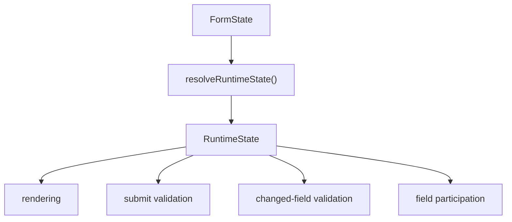

# Runtime Layer

Runtime Layer 从 reducer state 解析字段、分组和 container 的最终运行时能力。它是存储 meta 和 UI 行为之间的策略边界。

包根入口导出 `FieldCapability`、`GroupCapability`、`NodeCapability` 和 `RuntimeState` 类型，方便自定义 render hooks 或业务封装复用 Runtime snapshot 的类型约束。

### 为什么需要 Runtime

字段是否显示、是否参与提交、是否禁用、是否只读、是否需要校验，这些判断彼此关联。如果每个组件各自计算，很容易产生行为不一致。Runtime Layer 把这些策略集中到同一次解析中。

当前流程：



### 字段能力

每个字段会解析出：

| 能力 | 含义 |
| --- | --- |
| `rendered` | 字段是否应该渲染，字段自身可见性和所有父级 container 可见性都会影响结果。 |
| `submitable` | 字段是否参与提交数据，当前策略跟随 `rendered`。 |
| `disabled` | 字段是否被行为 meta 禁用。 |
| `readonly` | 字段是否被行为 meta 标记为只读。 |
| `editable` | 字段已渲染，且不是 disabled，也不是 readonly。 |
| `validatable` | 字段是否参与校验，当前策略是已渲染且未 disabled。 |

当前策略中，readonly 字段仍然参与校验。

### 分组能力

每个分组或 container 会解析出：

| 能力 | 含义 |
| --- | --- |
| `rendered` | 分组或 container 是否应该渲染。 |

分组/container 可见性会影响所有后代字段的渲染、提交和校验参与。

4.0 支持递归 container 子树。Runtime 会沿父链解析 container 可见性，父级隐藏时，所有后代 container 和字段都会被视为不可渲染。

### Meta 输入

Runtime 通过工具函数读取行为 meta：

- `getFieldBehaviorMeta`
- `getGroupBehaviorMeta`

这样可以兼容旧的 flat meta key，同时让新逻辑聚焦在 `meta.behavior`。

### Runtime 消费者

`FormContent` 只计算一次 runtime snapshot：

```ts
const runtimeState = useRuntimeState(state);
```

同一份 snapshot 会传给：

- `useFormRuntimeEvents`
- `useFieldParticipation`
- 默认字段渲染

这避免了不同消费者对同一份 state 重复、分散地解析能力。

### 校验策略

字段变更校验会先通过 runtime 过滤：

```ts
runtimeState.fields[fieldId]?.validatable === true
```

提交校验也用同样策略过滤所有 runtime 字段，然后从 Ant Design Form 读取提交数据。

不要直接这样校验：

```ts
form.validateFields(Object.keys(changedValues));
```

这会忽略隐藏字段、父级 container 隐藏字段、禁用字段和后续 Runtime 策略扩展。

### Runtime Inspection Helpers

4.1.2 新增一组只读 inspection helpers，用于设计器预览、调试面板和测试断言：

- `getFieldRuntimeSnapshot(runtimeState, fieldId)`：读取单个字段的 runtime 能力快照。
- `getRenderedFieldIds(runtimeState)`：读取当前会渲染的字段 id。
- `getSubmitableFieldIds(runtimeState)`：读取当前会进入提交数据的字段 id。
- `getValidatableFieldIds(runtimeState)`：读取当前需要参与校验的字段 id。

这些 helper 只消费已经解析好的 `runtimeState`，不会重新计算 Runtime，也不会改变隐藏字段清理、提交过滤或校验策略。

### 隐藏字段参与策略

`useFieldParticipation` 会在字段离开 submit participation 时清空字段值，除非 `preserveValueOnHide` 为 true。如果 `restoreValueOnShow` 不是 false，会缓存隐藏前的值，并在字段重新可提交时恢复。

这样默认能避免隐藏字段进入提交数据，同时给需要保留值的业务场景留出配置能力。

该策略同样适用于因 group 或 container 隐藏而离开 submit participation 的字段。`preserveValueOnHide` 和 `restoreValueOnShow` 都是字段级配置，不会被父级 container 自动覆盖。

### 扩展建议

- 新行为只有会影响运行时策略时，才应进入 behavior meta。
- 渲染专用配置应留在 `formItemProps` 或 `componentProps`。
- 新策略应优先修改 Runtime resolver，而不是在组件内重复判断。
- Ant Design Form 应继续作为 values 和校验运行时状态的所有者。
