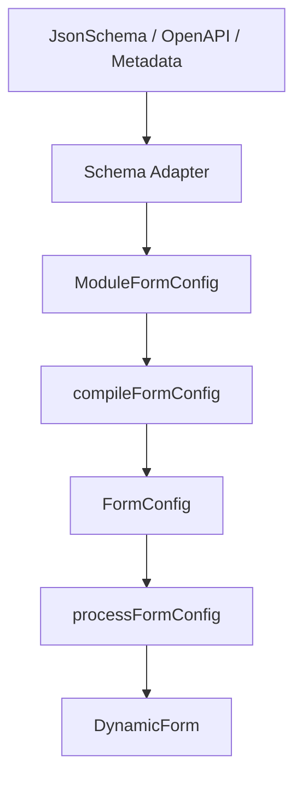

# Schema Adapters

DynamicForm 3.0 在 Adapter Foundation 之上提供具体 schema adapters：



Schema adapters 把输入转换成结构化 `ModuleFormConfig`。字段模块展开、group 装配、规则编译、依赖推导、组件注册和 runtime 行为继续由现有 compiler/runtime 管线负责。

Schema `required` 会映射为字段 `required` 语义，不会在 adapter 层直接生成 Ant Design `rules`。默认 Ant Design renderer 会统一把 `required` 合并成最终校验规则。

### JsonSchemaAdapter

支持顶层 object schema：

```ts
import { adaptModuleConfigs } from '@whynotsnow/dynamic-form';

const moduleConfigs = adaptModuleConfigs(
  {
    type: 'object',
    required: ['name'],
    properties: {
      name: {
        type: 'string',
        title: 'Name',
        metadata: {
          module: 'TextInputModule',
          name: ['profile', 'name'],
          options: { placeholder: 'Enter name' }
        }
      }
    }
  },
  { adapterType: 'json-schema' }
);
```

字段必须通过 `metadata.module` 或 `x-dynamic-form.module` 显式声明 module type。Adapter 不根据 `string`、`number`、`boolean` 等 schema type 猜测 UI 组件。

3.3 起，字段 metadata 可以显式声明 Field Address `name`，adapter 会把它写入 module config 的 `overrides.name`。这只是在 schema 输入中透传现有 `BaseFieldConfig.name` 能力，不会展开 nested object schema：

```ts
{
  metadata: {
    module: 'TextInputModule',
    name: ['profile', 'name']
  }
}
```

顶层 `x-dynamic-form.groups` 声明 groups，属性级 `x-dynamic-form.groupId` 声明成员关系。Schema 可配置 `initialVisible` 和 group-owned show/hide rules，但不能携带函数 effect。函数通过 `groupOverrides` 在 adapter 后、compiler 前注入：

```ts
compileAdaptedFormConfig(schema, {
  adapterType: 'json-schema',
  moduleRegistry,
  groupOverrides: {
    companyInfo: {
      effect: (changedValue, values) => ({ visible: values.enabled === true })
    }
  }
});
```

`groupOverrides` 会去重合并 `dependents`、将 override rules 追加到 schema rules 后，并用 override effect 替换 adapter effect。未知 group ID 会直接报错。

### OpenApiAdapter

支持 OpenAPI document 的 `components.schemas`：

```ts
const moduleConfigs = adaptModuleConfigs(openApiDocument, {
  adapterType: 'openapi',
  context: {
    metadata: { schemaName: 'User' }
  }
});
```

如果 OpenAPI document 只包含一个 schema，可以省略 `schemaName`。如果包含多个 schema，必须显式传入 `schemaName`。

### MetadataAdapter

支持项目自定义 metadata：

```ts
const moduleConfigs = adaptModuleConfigs(
  {
    fields: [
      {
        id: 'name',
        type: 'TextInputModule',
        name: ['profile', 'name'],
        options: { label: 'Name' },
        overrides: { required: true }
      }
    ]
  },
  { adapterType: 'metadata' }
);
```

每个 field 必须提供 `id` 和 `type`，可选透传 `name`、`options`、`rules`、`overrides`。`name` 会合并进 `overrides.name`，用于生成嵌套 values。

外部 schema 输入应通过 metadata 显式声明 `module`、`name`、`groupId`、`rules` 和 `overrides`。Adapter 只负责归一化输入，不通过 primitive type 猜测 UI，也不展开嵌套结构。

### Boundaries

- 不展开 nested object schema。
- 不展开 object array item schema。
- 不实现 validation rule engine。
- 除 `required` 外，不自动把 `minLength`、`maxLength`、`pattern`、`minimum`、`maximum` 转成 Ant Design rules；这些约束需要通过 metadata/module 的显式 `rules` 声明。这样可避免 adapter 隐式决定提示文案、触发时机和组件值语义。
- 不实现异步/API 规则，也不承诺提供 async validation compile；远程校验或远程选项应由自定义组件或业务容器负责。
- 不根据 schema type 自动猜测 UI 或 module type。
- 支持单层 groups 和 mixed fields；不支持 group 嵌套或一个字段属于多个 group。
