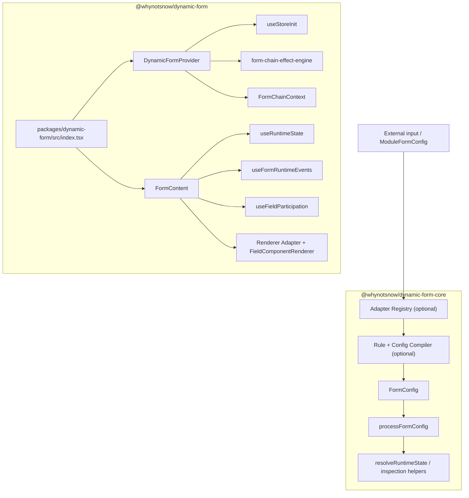

# Architecture

DynamicForm 4.2 is split into the pure `@whynotsnow/dynamic-form-core` package and the React/AntD-compatible `@whynotsnow/dynamic-form` package. Core owns Field Address, the unified node tree, Adapter / Module / Rule / Compiler preprocessing, config processing, config diagnostics, and pure Runtime resolvers. The React/AntD package owns `DynamicForm`, Provider, hooks, Form Adapter / Renderer Adapter, component registry, the default AntD renderer, and effect handler runtime.

### Repository Layout

The repository is now a monorepo:

- `packages/dynamic-form-core/` is the pure core npm package boundary for config, compiler, adapters, rules, pure Runtime, and shared pure types.
- `packages/dynamic-form/` is the React/AntD npm package boundary. It depends on core and continues to re-export core public APIs.
- `packages/dynamic-form/docs/` is the maintained source for the React/AntD-compatible entry documentation and is published with the npm package.
- Root `docs/` only maintains monorepo-level documentation such as workspace layout, release flow, site planning, and repository maintenance rules.
- `apps/docs-site/` is the Docusaurus site, with site-specific zh-CN docs and `i18n/en` content.
- `demos/` keeps the Vite demos and `demoRegistry`; the site reuses demo components and registry metadata without copying demo business logic.

### Module Map

The 4.2 main flow remains `FormConfig -> adapter/compiler -> processFormConfig -> Runtime -> renderer`. `DynamicForm` continues to accept the existing `FormConfig`; Adapter, Compiler, Rule Engine, and Schema Adapters are optional preprocessing layers that still output standard `FormConfig`. `fields`, `groups`, and `nodes` are normalized into the same node tree in the Config Layer. When `formAdapter` / `renderer` are omitted, DynamicForm uses `createAntdFormAdapter(form)` and `antdRenderer`. The difference is package ownership: UI-library agnostic config, compiler, rule, and pure Runtime capabilities live in core, while the React/AntD package consumes those capabilities and provides the default rendering runtime.

### Important Files

- `packages/dynamic-form-core/src/adapters/`: normalizes module-like, JsonSchema, OpenAPI, and metadata input into `ModuleFormConfig`.
- `packages/dynamic-form-core/src/modules/`: defines the `FieldModule` protocol and module registry.
- `packages/dynamic-form-core/src/rules/`: validates and evaluates declarative rules and compiles them into standard effects.
- `packages/dynamic-form-core/src/compiler/compileFormConfig.ts`: compiles `ModuleFormConfig` into standard `FormConfig` and a component registry.
- `packages/dynamic-form-core/src/config/processor/configParser.ts`: normalizes the node tree and creates `effectMap`, `nodeRegistry`, `containerRegistry`, `fieldRegistry`, `initialValues`, and initialized field/container state.
- `packages/dynamic-form-core/src/runtime/`: resolves pure field, container, and group runtime capabilities and exposes inspection helpers.
- `packages/dynamic-form/src/CompiledDynamicForm.tsx`: wires compiler output and its component registry into `DynamicForm`.
- `packages/dynamic-form/src/index.tsx`: splits `DynamicFormProps` into engine props and UI props.
- `packages/dynamic-form/src/consumer/provider/DynamicFormProvider.tsx`: initializes store, effect engine, and React context.
- `packages/dynamic-form/src/consumer/formAdapter.ts`: provides the default AntD form adapter and converts the legacy `form` instance into the neutral `DynamicFormFormAdapter`.
- `packages/dynamic-form/src/state/useStoreInit.ts`: processes config, creates reducer state, merges initial values, and syncs them to the form runtime through the form adapter.
- `packages/dynamic-form/src/state/reducer.ts`: handles field meta, group meta, and dynamic UI config updates with Immer.
- `packages/dynamic-form/src/consumer/render/FormContent.tsx`: walks Runtime nodes, calls the renderer adapter, and wires submit/change events.
- `packages/dynamic-form/src/consumer/render/antdRenderer.tsx`: the default AntD renderer for `Form`, `Form.Item`, `Form.List`, `Row`, `Col`, `Card`, and `Button` shells.
- `packages/dynamic-form/src/consumer/effects/`: applies effect results through handlers.
- `packages/dynamic-form/src/consumer/render/componentRegistry.tsx`: provides built-in components and custom registration.

### Data Flow

1. An optional adapter normalizes external input into `ModuleFormConfig`.
2. The optional compiler expands field modules, compiles field/group rules, and creates standard `FormConfig` plus a component registry.
3. The user supplies handwritten `FormConfig` to `DynamicForm`, or compiler output to `CompiledDynamicForm`.
4. `DynamicForm` passes engine props to `DynamicFormProvider` and UI props to `FormContent`.
5. `useStoreInit` calls `processFormConfig(formConfig)`.
6. Config processing normalizes `nodes`, `fields`, and `groups` into a node tree, then creates dependency maps, node/container/field registries, initial values, and initialized field/container state.
7. The reducer receives `INIT` and stores node structure, meta, config process info, and dynamic UI config.
8. `DynamicFormProvider` initializes `form-chain-effect-engine` with `effectMap`.
9. `FormContent` computes one `runtimeState` from reducer state.
10. Rendering, validation, and hidden-field participation consume that same `runtimeState`.
11. User input triggers runtime-filtered validation and then the effect engine.
12. Effect results pass through `applyEffectResult`, and handlers update form values through the form adapter or update field meta, group meta, or dynamic UI config.

### State Ownership

The form runtime owns values, validation errors and warnings, touched and validating state, and submitted value retrieval. The default form runtime is Ant Design Form.

DynamicForm reducer owns flat field state, container/group field state, node state and root node order, field behavior/render meta, container/group behavior meta, config processing info, dynamic UI config, and initialized state.

The reducer intentionally does not maintain a duplicate value store. Effect handlers that update values should call the provided `setFieldValue` helper or `formAdapter`.

### Layer Responsibilities

- Core Adapter Layer: converts external input into `ModuleFormConfig` without deciding renderer behavior.
- Core Module / Compiler Layer: expands domain field modules, assembles flat/grouped/mixed/nodes structure, and outputs standard `FormConfig`.
- Core Rule Layer: compiles synchronous declarative rules into standard effects without replacing the effect engine or Ant Design validation.
- Core Config Layer: normalizes flat/grouped/mixed/nodes `FormConfig` into a node tree and runtime inputs.
- State Layer: lives in the React/AntD package and stores initialized field/container structure and meta while normalizing legacy flat meta keys.
- Runtime Layer: core provides pure resolvers, and the React/AntD package uses `useRuntimeState` to consume one Runtime snapshot for UI behavior.
- Consumer Layer: connects provider, form adapter, renderer adapter, hooks, effect results, and component registry.
- Shared Layer: core contains pure public types and utilities; the React/AntD package adds React context, initialization checks, and UI-related types.

### Maintenance Constraints

- Field lookup should use `configProcessInfo.fieldRegistry` because fields can be flat or inside any container.
- Runtime should be computed once per state snapshot in `FormContent`.
- Validation must be filtered through `runtimeState.fields[fieldId].validatable`.
- Hidden fields are excluded from submit participation unless explicitly preserved.
- Container visibility must propagate through the parent chain to all descendants.
- Render hooks can bypass default rendering, so extension behavior changes should be deliberate.
- Adapters, the compiler, and the Rule Engine should remain outside React runtime and must not directly own Form instances or reducer state.
