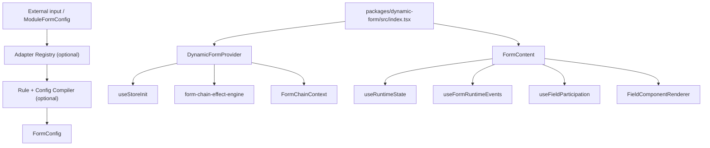

# Architecture

DynamicForm 3.2 combines the Field Address foundation, optional Adapter / Module / Rule / Compiler preprocessing, and a stable Config / State / Runtime / Consumer / Shared runtime pipeline. It separates logical field identity from value paths while preserving Ant Design Form as the owner of actual values and validation runtime state.

### Repository Layout

The repository is now a monorepo:

- `packages/dynamic-form/` is the only npm package boundary. It contains the library source, `tsup` config, and package manifest.
- `packages/dynamic-form/docs/` is the maintained source for DynamicForm library documentation and is published with the npm package.
- Root `docs/` only maintains monorepo-level documentation such as workspace layout, release flow, site planning, and repository maintenance rules.
- `apps/docs-site/` is the Docusaurus site, with site-specific zh-CN docs and `i18n/en` content.
- `demos/` keeps the Vite demos and `demoRegistry`; the site reuses demo components and registry metadata without copying demo business logic.

### Module Map

The 3.x main flow remains `FormConfig -> adapter/compiler -> processFormConfig -> Runtime -> renderer`. `DynamicForm` continues to accept the existing `FormConfig`; Adapter, Compiler, Rule Engine, and Schema Adapters are optional preprocessing layers that still output the current standard `FormConfig`.

### Important Files

- `packages/dynamic-form/src/adapters/`: normalizes module-like, JsonSchema, OpenAPI, and metadata input into `ModuleFormConfig`.
- `packages/dynamic-form/src/modules/`: defines the `FieldModule` protocol and module registry.
- `packages/dynamic-form/src/rules/`: validates and evaluates declarative rules and compiles them into standard effects.
- `packages/dynamic-form/src/compiler/compileFormConfig.ts`: compiles `ModuleFormConfig` into standard `FormConfig` and a component registry.
- `packages/dynamic-form/src/CompiledDynamicForm.tsx`: wires compiler output and its component registry into `DynamicForm`.
- `packages/dynamic-form/src/index.tsx`: splits `DynamicFormProps` into engine props and UI props.
- `packages/dynamic-form/src/consumer/provider/DynamicFormProvider.tsx`: initializes store, effect engine, and React context.
- `packages/dynamic-form/src/state/useStoreInit.ts`: processes config, creates reducer state, merges initial values, and syncs Ant Design Form.
- `packages/dynamic-form/src/config/processor/configParser.ts`: creates `effectMap`, `fieldRegistry`, `initialValues`, `initializedFields`, and `initializedGroupFields`.
- `packages/dynamic-form/src/state/reducer.ts`: handles field meta, group meta, and dynamic UI config updates with Immer.
- `packages/dynamic-form/src/runtime/resolver.ts`: resolves field and group runtime capabilities.
- `packages/dynamic-form/src/consumer/render/FormContent.tsx`: renders the form and wires submit/change events.
- `packages/dynamic-form/src/consumer/effects/`: applies effect results through handlers.
- `packages/dynamic-form/src/consumer/render/componentRegistry.tsx`: provides built-in components and custom registration.

### Data Flow

1. An optional adapter normalizes external input into `ModuleFormConfig`.
2. The optional compiler expands field modules, compiles field/group rules, and creates standard `FormConfig` plus a component registry.
3. The user supplies handwritten `FormConfig` to `DynamicForm`, or compiler output to `CompiledDynamicForm`.
4. `DynamicForm` passes engine props to `DynamicFormProvider` and UI props to `FormContent`.
5. `useStoreInit` calls `processFormConfig(formConfig)`.
6. Config processing creates dependency maps, field registry, initial values, and initialized field/group state.
7. The reducer receives `INIT` and stores structure, meta, config process info, and dynamic UI config.
8. `DynamicFormProvider` initializes `form-chain-effect-engine` with `effectMap`.
9. `FormContent` computes one `runtimeState` from reducer state.
10. Rendering, validation, and hidden-field participation consume that same `runtimeState`.
11. User input triggers runtime-filtered validation and then the effect engine.
12. Effect results pass through `applyEffectResult`, and handlers update Ant Design Form values, field meta, group meta, or dynamic UI config.

### State Ownership

Ant Design Form owns values, validation errors and warnings, touched and validating state, and submitted value retrieval.

DynamicForm reducer owns flat field state, grouped field state, field behavior/render meta, group behavior meta, config processing info, dynamic UI config, and initialized state.

The reducer intentionally does not maintain a duplicate value store. Effect handlers that update values should call `form.setFieldsValue`.

### Layer Responsibilities

- Adapter Layer: converts external input into `ModuleFormConfig` without deciding Runtime or renderer behavior.
- Module / Compiler Layer: expands domain field modules, assembles flat/grouped/mixed structure, and outputs standard `FormConfig`.
- Rule Layer: compiles synchronous declarative rules into standard effects without replacing the effect engine or Ant Design validation.
- Config Layer: normalizes flat/grouped/mixed `FormConfig` into runtime inputs.
- State Layer: stores initialized field/group structure and meta while normalizing legacy flat meta keys.
- Runtime Layer: resolves rendered, submitable, editable, readonly, disabled, and validatable policy.
- Consumer Layer: connects provider, rendering, hooks, effect results, and component registry.
- Shared Layer: contains types, context, utilities, and meta normalization helpers.

### Maintenance Constraints

- Field lookup should use `configProcessInfo.fieldRegistry` because fields can be flat or grouped.
- Runtime should be computed once per state snapshot in `FormContent`.
- Validation must be filtered through `runtimeState.fields[fieldId].validatable`.
- Hidden fields are excluded from submit participation unless explicitly preserved.
- Render hooks can bypass default rendering, so extension behavior changes should be deliberate.
- Adapters, the compiler, and the Rule Engine should remain outside React runtime and must not directly own Form instances or reducer state.
