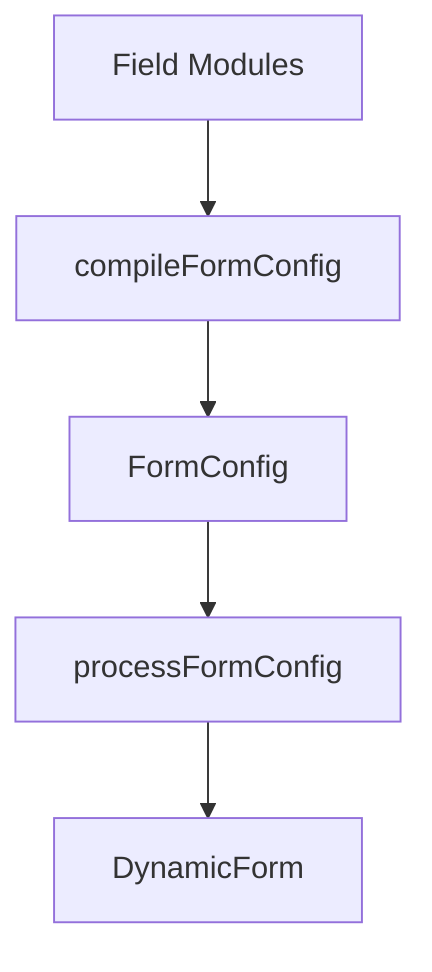

# Compiler Foundation

DynamicForm provides a field module and compiler layer before the existing `FormConfig` pipeline. Version 4.0 supports flat fields, legacy groups, and recursive `nodes`.



This is additive. Existing `FormConfig` usage does not need to change.

### Field Modules

A field module packages reusable business-field behavior:

```ts
import type { FieldModule } from '@whynotsnow/dynamic-form';

interface UserSelectorOptions {
  label?: string;
  options?: Array<{ label: string; value: string }>;
}

export const UserSelectorModule: FieldModule<UserSelectorOptions> = {
  type: 'UserSelector',
  defaultProps: {
    allowClear: true,
    showSearch: true
  },
  dependencies: ['departmentId'],
  createConfig: (options) => ({
    id: 'userId',
    label: options?.label ?? 'User',
    component: 'Select',
    componentProps: {
      options: options?.options ?? []
    }
  })
};
```

Modules describe domain fields. Render components are still resolved by the existing component registry.

`FieldModule<TOptions>` and `ModuleConfig<TOptions>` provide module-level option typing. Their default remains `Record<string, unknown>`, so existing callers do not need to migrate. The registry still resolves modules by runtime `type`; this version does not attempt a global type-to-options mapping across heterogeneous config arrays.

### Registry

Use `ModuleRegistryManager` for isolated registries or `defaultModuleRegistry` for shared registration.

```ts
import { ModuleRegistryManager } from '@whynotsnow/dynamic-form';

const registry = new ModuleRegistryManager();

registry.register(UserSelectorModule);
registry.has('UserSelector');
registry.get('UserSelector');
registry.list();
registry.unregister('UserSelector');
```

Duplicate module types are rejected by default. Pass `{ override: true }` when replacement is intentional.

### Compiler

Compile module config into standard `FormConfig`:

```tsx
import { Form } from 'antd';
import { DynamicForm, compileFormConfig } from '@whynotsnow/dynamic-form';

const compiled = compileFormConfig(
  {
    fields: [
      {
        type: 'UserSelector',
        id: 'ownerId',
        options: { label: 'Owner' },
        overrides: {
          required: true
        }
      }
    ]
  },
  { registry }
);

export function Example() {
  const [form] = Form.useForm();

  return (
    <DynamicForm
      form={form}
      formConfig={compiled.formConfig}
      componentRegistry={{ customComponents: compiled.componentRegistry }}
    />
  );
}
```

The higher-level `CompiledDynamicForm` is recommended when rendering compiler output because it automatically wires the returned component registry:

```tsx
import { CompiledDynamicForm } from '@whynotsnow/dynamic-form';

<CompiledDynamicForm form={form} compiled={compiled} />;
```

An additional `componentRegistry` may still be provided; an explicitly supplied custom component wins on name conflicts. The lower-level manual `DynamicForm` integration remains available when config and registry need separate control.

The compiler returns:

```ts
{
  formConfig: FormConfig;
  componentRegistry: ComponentRegistry;
}
```

`formConfig` can be passed to `processFormConfig()` or `DynamicForm`.

### Mixed Fields And Groups

Compiler input is unified as `ModuleFormConfig`. Fields may be declared through flat `fields` and join legacy groups through `groupId`; recursive structure can be declared through `nodes`. Group/container rules only support `show` and `hide`. Manual `effect` runs first, and rules run afterward with matching result keys taking precedence.

```ts
compileFormConfig({
  fields: [
    { type: 'AccountType', id: 'accountType' },
    { type: 'CompanyName', id: 'companyName', groupId: 'companyInfo' }
  ],
  groups: [
    {
      id: 'companyInfo',
      title: 'Company Information',
      initialVisible: false,
      rules: [{ when: { field: 'accountType', equals: 'company' }, then: { action: 'show' } }]
    }
  ]
});
```

The compiler validates globally unique IDs, valid group references, and non-empty groups.

### Nodes And Containers

`ModuleFormConfig.nodes` declares recursive module trees. Field nodes use `nodeType: 'field'`; container nodes use `nodeType: 'container'`:

```ts
const compiled = compileFormConfig({
  nodes: [
    {
      nodeType: 'container',
      id: 'shipping',
      title: 'Shipping',
      name: 'shipping',
      rules: [{ when: { field: 'hasShipping', equals: true }, then: { action: 'show' } }],
      children: [
        {
          nodeType: 'field',
          type: 'TextInput',
          id: 'shippingCity',
          options: { label: 'City' }
        }
      ]
    }
  ]
});
```

The compiler expands field modules into `FieldNode` and containers into `ContainerNode`. Module components still enter `componentRegistry`, so `CompiledDynamicForm` is the recommended rendering entry point for compiler output.

Containers may declare `name`; config processing uses it as an Ant Design `NamePath` prefix for descendant fields. Containers with `repeatable: true` must declare `name`; the default renderer uses Ant Design `Form.List` for existing repeated items.

### Hooks

Compiler hooks allow compile-time extension:

```ts
compileFormConfig(moduleFormConfig, {
  registry,
  hooks: {
    beforeCompile(context) {},
    beforeModuleExpand(context) {},
    afterModuleExpand(context) {},
    afterCompile(context) {}
  }
});
```

Hooks operate on compiler context only. They should not mutate Ant Design Form instances or React runtime state.

### Boundaries

- `compileFormConfig()` creates `FormConfig`.
- `processFormConfig()` keeps preparing runtime data.
- `DynamicForm` props are unchanged.
- `compileFormConfig()` supports flat, grouped, mixed, and recursive nodes output.
- Groups do not change field value paths; container `name` prefixes descendant value paths.
- Ant Design Form remains the source of truth for values and validation state.
