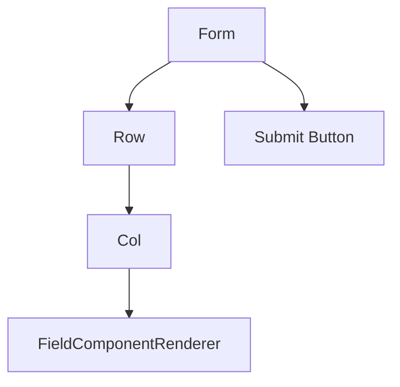
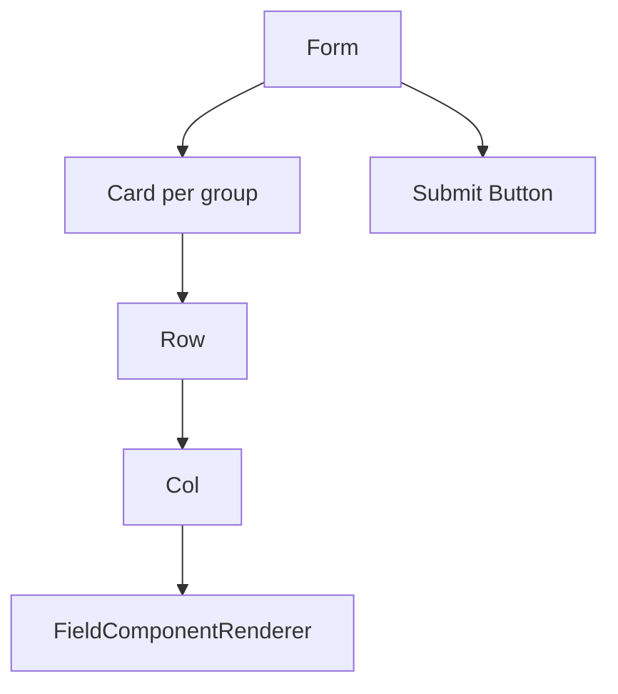

# Rendering and UI Extensions

`FormContent` provides the default rendering pipeline and exposes layered extension points. Starting in 4.1, the default UI is provided by `antdRenderer`; applications can keep using render hooks for local changes or replace the default shell through `renderer`.

### Default Rendering

Flat forms:



Grouped forms:



The default `antdRenderer` uses `Form`, `Row`, `Col`, `Card`, and `Button`.

`FieldComponentRenderer` resolves the component, applies `Form.Item` props, maps runtime disabled/readonly state, and suppresses rules when a field is not runtime-validatable. Field-level `required: true` is automatically merged into a required rule by the default Ant Design renderer, while explicit required rules take precedence.

### 4.1 Form / Renderer Adapter

4.1 adds two optional extension points:

- `formAdapter`: wraps form value access and validation through `getFieldValue`, `getFieldsValue`, `setFieldValue`, `setFieldsValue`, and `validateFields`.
- `renderer`: wraps the default UI shell, including the form, field item, field-list layout, field layout, group container, repeatable container, and submit button.
- `assertFormAdapter` / `assertRendererAdapter`: validate required adapter methods during initialization.

When `formAdapter` is omitted, `DynamicForm` converts the legacy AntD `form` instance with `createAntdFormAdapter(form)`. When `renderer` is omitted, it uses `antdRenderer`. Existing 4.0 AntD usage remains compatible:

```tsx
<DynamicForm form={form} formConfig={formConfig} />
```

A custom component-library renderer can reuse the core Runtime and render hooks while replacing the default UI shell:

```tsx
<DynamicForm
  formAdapter={customFormAdapter}
  renderer={customRenderer}
  formConfig={formConfig}
/>
```

4.1.1 also provides two UI-library-free reference implementations:

- `createMemoryFormAdapter(initialValues)`: maintains an in-memory values store and no-op `validateFields`; it is useful for tests, custom renderer examples, and visual-builder preview mode.
- `headlessRenderer`: renders the smallest native shell with `<form>`, `<label>`, `<div>`, `<fieldset>`, and `<button>`. It is not intended to replace a production component library.

4.1 provides the AntD default implementation, headless reference implementations, and extension interfaces. It does not include built-in Arco, Semi, or other component-library renderers.

### Nodes and Container Rendering Contract

The 4.0 `nodes` entry renders root nodes in order as continuous field segments and container blocks:

- Continuous field segments are rendered through `renderFields`. The default structure remains `Row -> Col -> FieldComponentRenderer`.
- A container is a block boundary and splits adjacent field segments. By default, a container renders as a `Card`, and its children are segmented recursively with the same rule.
- When a normal container uses `renderGroupItem`, `defaultRender` includes the complete children rendering, including nested containers.
- A repeatable container uses `Form.List`. Each list item also renders its children as continuous field segments and rewrites field names to list-item-relative paths.

As a result, `renderFields` applies not only to legacy flat fields or fields inside groups, but also to top-level continuous fields, field segments split by containers in mixed root nodes, nested container field segments, and repeatable item field segments.

### Component Registry

Use `componentRegistry` to register business-specific field components. Custom components receive `field`, `value`, `onChange`, `form`, and optional `formAdapter`.

By default, custom components do not replace built-ins. Set `allowOverride: true` only when replacement is intentional.

### Render Hooks

Render hooks are layered from smallest to largest scope:

- `renderFieldItem`: customize one field item.
- `renderFields`: customize a field list.
- `renderGroupItem`: customize one group.
- `renderGroups`: customize all groups.
- `renderFormInner`: customize the full form body and submit area.

Each hook receives lower-level render functions and `defaultRender`, so callers can wrap or replace only the part they need.

The `renderer` creates the default UI, while render hooks remain the business-side override layer. In other words, `renderer` creates `defaultRender` first, then `renderFieldItem`, `renderFields`, `renderGroupItem`, `renderGroups`, or `renderFormInner` can wrap or replace it.

### Choosing an Extension Point

Use `uiConfig` when the default structure is still correct and only Ant Design props need to change. Use `componentRegistry` when the field input itself is business-specific. Use render hooks when the layout structure needs to change. Implement `formAdapter` and `renderer` when another Form runtime or UI shell needs to be connected.

Default rendering respects Runtime. Custom render hooks can bypass those defaults if they ignore the provided render helpers, so full replacement should be intentional.
