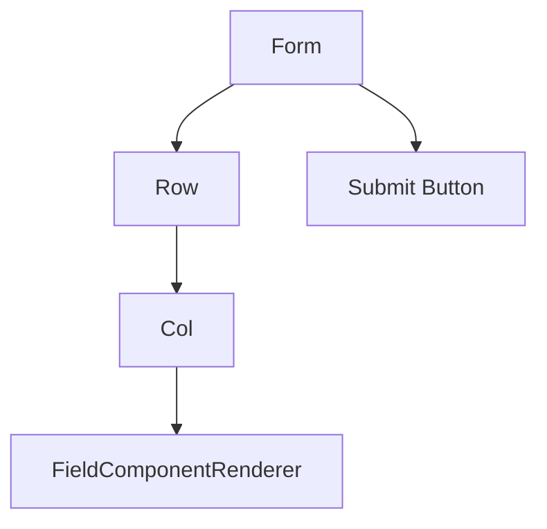
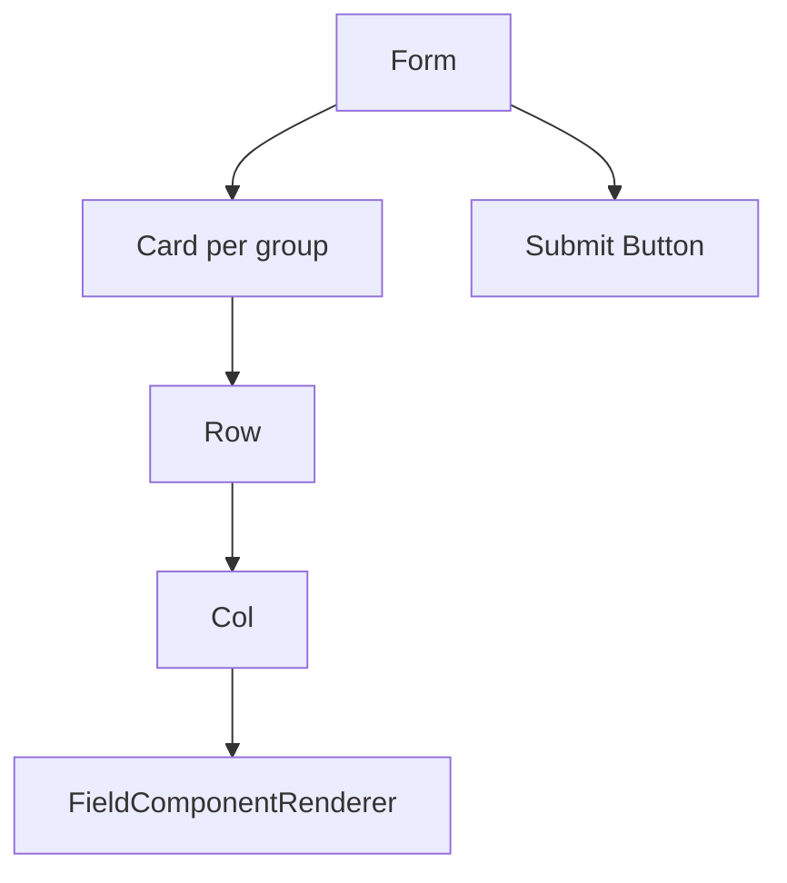

# Rendering and UI Extensions

`FormContent` provides the default Ant Design rendering pipeline and exposes layered extension points. The default UI is intentionally simple and can be replaced incrementally.

### Default Rendering

Flat forms:

Grouped forms:

Default rendering uses `Form`, `Row`, `Col`, `Card`, and `Button`.

`FieldComponentRenderer` resolves the component, applies `Form.Item` props, maps runtime disabled/readonly state, and suppresses rules when a field is not runtime-validatable. Field-level `required: true` is automatically merged into a required rule by the default Ant Design renderer, while explicit required rules take precedence.

### Component Registry

Use `componentRegistry` to register business-specific field components. Custom components receive `field`, `value`, `onChange`, and `form`.

By default, custom components do not replace built-ins. Set `allowOverride: true` only when replacement is intentional.

### Render Hooks

Render hooks are layered from smallest to largest scope:

- `renderFieldItem`: customize one field item.
- `renderFields`: customize a field list.
- `renderGroupItem`: customize one group.
- `renderGroups`: customize all groups.
- `renderFormInner`: customize the full form body and submit area.

Each hook receives lower-level render functions and `defaultRender`, so callers can wrap or replace only the part they need.

### Choosing an Extension Point

Use `uiConfig` when the default structure is still correct and only Ant Design props need to change. Use `componentRegistry` when the field input itself is business-specific. Use render hooks when the layout structure needs to change.

Default rendering respects Runtime. Custom render hooks can bypass those defaults if they ignore the provided render helpers, so full replacement should be intentional.
