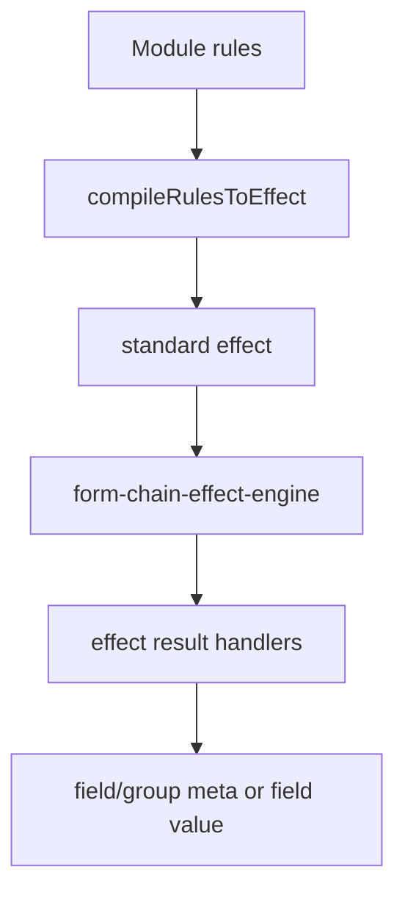

# Rule Engine

DynamicForm 3.0 provides a declarative synchronous Rule Engine. Rules belong to the affected field or group and are compiled into standard effects, preserving the responsibilities of `processFormConfig()`, the Runtime Layer, and the renderer.

### Execution Position

Both field modules and `ModuleConfig` entries may declare `rules`. Module rules are merged before instance rules. A handwritten effect runs first, and rule results run afterward with matching result keys taking precedence.

### Conditions

Field conditions are `equals`, `notEquals`, `empty`, and `notEmpty`. Composite conditions are `all`, `any`, and `not`.

The compiler normally infers `dependents` from `when`. When a rule declares `dependencies`, the explicit list is used instead.

### Field Actions

Field rules support `show`, `hide`, `enable`, `disable`, `readonly`, `editable`, `setValue`, and `clearValue`.

### Group Rules

Group rules support only `show` and `hide`, updating the visibility of the owning group.

### Ownership Constraint

Rules do not support `target`. Declare a field rule on the affected field and a group rule on the affected group. When one source field affects multiple fields, declare a rule on each affected field; those rules may depend on the same source field.

### Public API

- `RuleEngine`
- `createRuleEngine()`
- `evaluateRule()`
- `compileRulesToEffect()`
- Public types including `DeclarativeRule`, `GroupDeclarativeRule`, `RuleCondition`, and `RuleAction`

Application code should normally consume rules through `compileFormConfig()`. Direct Rule Engine APIs are most useful for tests, custom compilers, or another synchronous rule entry point.

### Boundaries

- Evaluation is synchronous and does not perform requests or side effects.
- Async rules, remote rules, cancellation, and race strategies are not supported. Put those async interactions in custom field components, application containers, or Ant Design `rules.validator`.
- The current roadmap does not commit to library-level async validation compilation.
- Rules do not replace Ant Design validation rules.
- Rules do not replace `form-chain-effect-engine`; they generate standard effects for it.
- Rules do not maintain a separate values store and read the current values snapshot provided by the effect engine.
