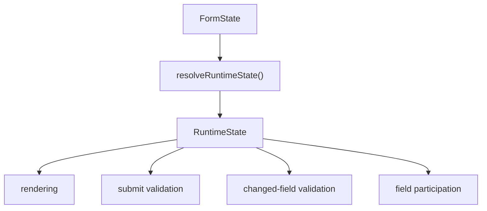

# Runtime Layer

The Runtime Layer resolves final field and group capabilities from reducer state. It is the policy boundary between stored meta and UI behavior.

Starting in 3.3, the package root exports `FieldCapability`, `GroupCapability`, and `RuntimeState` types so custom render hooks and application wrappers can type Runtime snapshots directly.

### Why Runtime Exists

Visibility, submission, disabled state, readonly state, and validation are related decisions. If each component computes them independently, behavior diverges. Runtime centralizes those policies in one resolution step.

The current flow is:

### Field Capabilities

Each field resolves to `rendered`, `submitable`, `disabled`, `readonly`, `editable`, and `validatable`.

`rendered` is affected by field and group visibility. `submitable` currently follows `rendered`. `validatable` currently means rendered and not disabled. Readonly fields still validate.

### Group Capabilities

Each group resolves to `rendered`. Group visibility affects child field rendering and submit participation.

3.2 only supports the current single-level `groups -> fields` model. Runtime resolves field/group capabilities and propagates group visibility to direct child fields; it does not resolve nested groups, container subtrees, recursive node trees, or cross-level node capabilities. Those structural capabilities belong to the future unified node tree plan and are not current public APIs.

### Meta Input

Runtime reads behavior meta through `getFieldBehaviorMeta` and `getGroupBehaviorMeta`. This keeps compatibility with legacy flat meta keys while centering new logic on `meta.behavior`.

### Consumers

`FormContent` computes one runtime snapshot with `useRuntimeState(state)` and passes it to `useFormRuntimeEvents`, `useFieldParticipation`, and default field rendering.

### Validation Policy

Changed-field validation and submit validation both filter fields through `runtimeState.fields[fieldId]?.validatable === true`. Avoid direct validation against changed keys because it ignores hidden, group-hidden, disabled, and future runtime policies.

### Hidden Field Participation

`useFieldParticipation` clears a field value when it leaves submit participation unless `preserveValueOnHide` is true. If `restoreValueOnShow` is not false, the old value is cached and restored when the field becomes submitable again.

The same policy applies when a field leaves submit participation because its group is hidden. `preserveValueOnHide` and `restoreValueOnShow` are field-level options and are not automatically overridden by the group.

### Extension Guidance

Add behavior state to meta only if Runtime should decide with it. Keep render-only props in `formItemProps` or `componentProps`. Update runtime resolvers instead of duplicating policy inside components. Keep Ant Design Form as the owner of values and validation runtime state.
