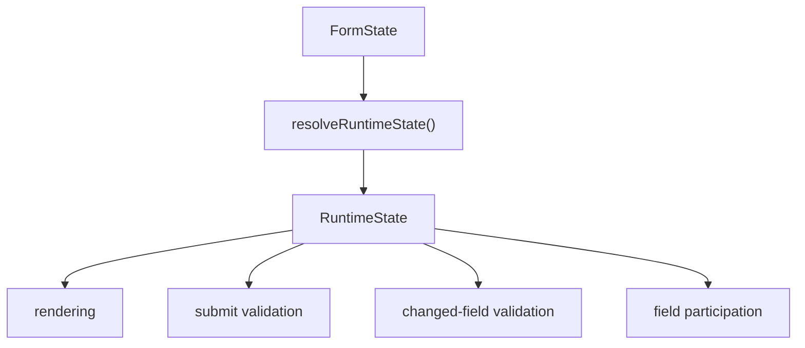

# Runtime Layer

The Runtime Layer resolves final field, group, and container capabilities from reducer state. It is the policy boundary between stored meta and UI behavior.

The package root exports `FieldCapability`, `GroupCapability`, `NodeCapability`, and `RuntimeState` types so custom render hooks and application wrappers can type Runtime snapshots directly.

## Why Runtime Exists

Visibility, submission, disabled state, readonly state, and validation are related decisions. If each component computes them independently, behavior diverges. Runtime centralizes those policies in one resolution step.

The current flow is:

## Field Capabilities

Each field resolves to `rendered`, `submitable`, `disabled`, `readonly`, `editable`, and `validatable`.

`rendered` is affected by field visibility and all parent container visibility. `submitable` currently follows `rendered`. `validatable` currently means rendered and not disabled. Readonly fields still validate.

## Group Capabilities

Each group or container resolves to `rendered`. Group/container visibility affects rendering, submission, and validation participation for all descendant fields.

Version 4.0 supports recursive container subtrees. Runtime resolves container visibility through the parent chain; when a parent is hidden, all descendant containers and fields are treated as not rendered.

## Meta Input

Runtime reads behavior meta through `getFieldBehaviorMeta` and `getGroupBehaviorMeta`. This keeps compatibility with legacy flat meta keys while centering new logic on `meta.behavior`.

## Consumers

`FormContent` computes one runtime snapshot with `useRuntimeState(state)` and passes it to `useFormRuntimeEvents`, `useFieldParticipation`, and default field rendering.

## Validation Policy

Changed-field validation and submit validation both filter fields through `runtimeState.fields[fieldId]?.validatable === true`. Avoid direct validation against changed keys because it ignores hidden, parent-container-hidden, disabled, and future runtime policies.

## Runtime Inspection Helpers

4.1.2 adds read-only inspection helpers for visual-builder previews, debug panels, and tests:

- `getFieldRuntimeSnapshot(runtimeState, fieldId)`: reads one field capability snapshot.
- `getRenderedFieldIds(runtimeState)`: reads field ids that currently render.
- `getSubmitableFieldIds(runtimeState)`: reads field ids that currently participate in submitted data.
- `getValidatableFieldIds(runtimeState)`: reads field ids that currently participate in validation.

These helpers only consume an already resolved `runtimeState`. They do not recompute Runtime or change hidden-field cleanup, submit filtering, or validation policy.

## Hidden Field Participation

`useFieldParticipation` clears a field value when it leaves submit participation unless `preserveValueOnHide` is true. If `restoreValueOnShow` is not false, the old value is cached and restored when the field becomes submitable again.

The same policy applies when a field leaves submit participation because its group or container is hidden. `preserveValueOnHide` and `restoreValueOnShow` are field-level options and are not automatically overridden by parent containers.

## Extension Guidance

Add behavior state to meta only if Runtime should decide with it. Keep render-only props in `formItemProps` or `componentProps`. Update runtime resolvers instead of duplicating policy inside components. Keep Ant Design Form as the owner of values and validation runtime state.
