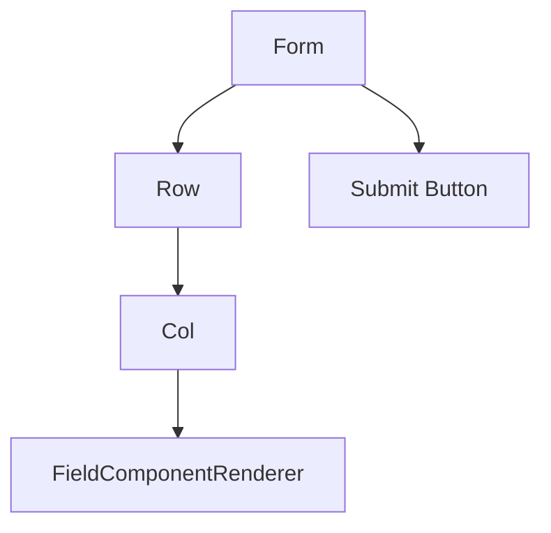
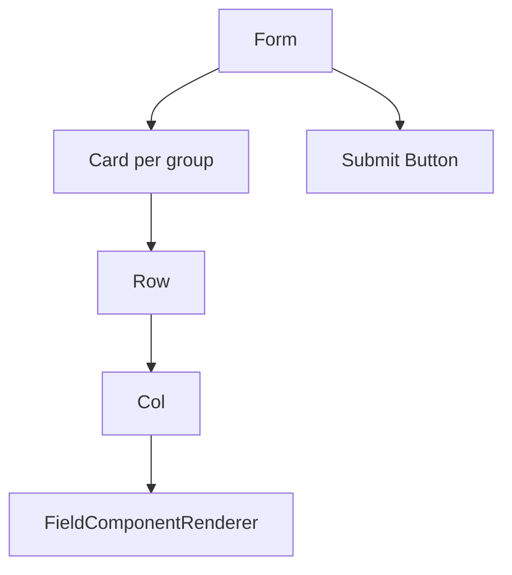

# 渲染与 UI 扩展

`FormContent` 提供默认 Ant Design 渲染流水线，并暴露分层扩展点。默认 UI 保持简单，业务侧可以按需逐层替换。

### 默认渲染结构

平铺表单：



分组表单：



默认渲染使用：

- `Form`
- `Row`
- `Col`
- `Card`
- `Button`

`FieldComponentRenderer` 负责解析组件、应用 `Form.Item` props、应用 runtime disabled/readonly 状态，并在字段不可校验时移除 `Form.Item` rules。字段 `required: true` 会在默认 Ant Design renderer 中自动合并为 required rule；显式 `rules` 中的 required rule 优先。

### 组件注册

通过 `componentRegistry` 注册业务字段组件。

```tsx
const componentRegistry = {
  customComponents: {
    ProjectSelect: ProjectSelectField
  },
  allowOverride: false
};

<DynamicForm
  form={form}
  formConfig={formConfig}
  componentRegistry={componentRegistry}
/>;
```

自定义组件接收：

```ts
interface FieldComponentProps {
  field: FieldState;
  value?: FieldValue;
  onChange?: (value: FieldValue) => void;
  form: FormInstance;
}
```

默认情况下，自定义组件不会覆盖内置组件。只有明确需要替换内置组件时，才设置 `allowOverride: true`。

### Render Hooks

render hooks 按作用范围从小到大排列：

| Hook | 作用 |
| --- | --- |
| `renderFieldItem` | 自定义单个字段项。 |
| `renderFields` | 自定义字段列表。 |
| `renderGroupItem` | 自定义单个分组。 |
| `renderGroups` | 自定义所有分组。 |
| `renderFormInner` | 自定义整个表单 body 和提交区域。 |

每个 hook 都会收到下层 render 函数和 `defaultRender`，可以只包装需要扩展的部分。

### 字段项扩展

```tsx
<DynamicForm
  form={form}
  formConfig={formConfig}
  renderFieldItem={({ field, defaultRender }) => {
    if (field.id !== 'username') return defaultRender;

    return (
      <div>
        <div style={{ marginBottom: 8 }}>Username is used for login.</div>
        {defaultRender}
      </div>
    );
  }}
/>
```

### 分组扩展

```tsx
<DynamicForm
  form={form}
  formConfig={formConfig}
  renderGroups={({ groupFields, renderGroupItem }) => {
    const items = Object.values(groupFields).map((group) => ({
      key: group.id,
      label: group.title ?? group.id,
      children: renderGroupItem(group)
    }));

    return <Tabs items={items} />;
  }}
/>
```

### 整体表单扩展

```tsx
<DynamicForm
  form={form}
  formConfig={formConfig}
  renderFormInner={({ fields, renderFields, defaultRender }) => (
    <>
      {renderFields([fields.name, fields.email].filter(Boolean))}
      {defaultRender.submitArea}
    </>
  )}
/>
```

### 扩展方式选择

- 只改默认 Ant Design props：使用 `uiConfig`。
- 字段控件本身有业务逻辑：使用 `componentRegistry`。
- 结构需要变化，例如 Tabs、特殊分组、自定义提交区：使用 render hooks。

默认渲染尊重 Runtime：不可渲染字段返回 `null`，分组隐藏时子字段不渲染，disabled/readonly 会传给组件，不可校验字段不会挂载 rules。

自定义 render hooks 如果不使用提供的 render helper，可能绕过 Runtime 默认行为，应谨慎处理。
